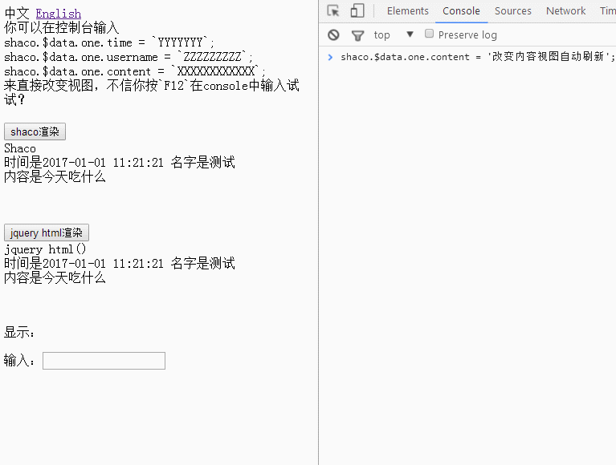
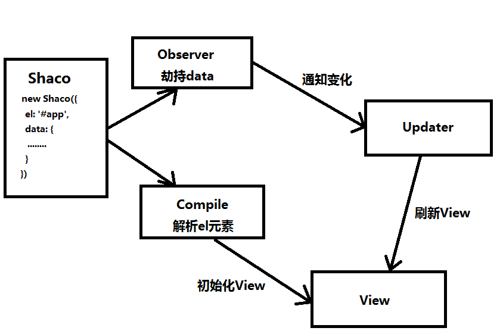
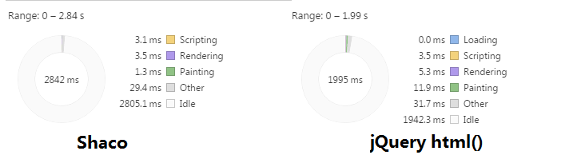

# shaco
> a mini js which help you solve some questions about views-rendering, especially jQuery！

一个可以帮你解决一些关于视图渲染的问题的轻量js，特别是对于jQuery！

> When you update data, shaco will automatically render view!It spends less time than jQuery `html()`!

当你更新数据的时候，shaco将会自动刷新视图，它比`jQuery`的`html()`花费更少的时间!

## Show


## Live Demos
[中文](https://blog.shanamaid.top/shaco/index.html)

[English](https://blog.shanamaid.top/shaco/index-en.html)

## Usage
```
<div id="app" style="margin-bottom: 50px;">
  <div>
    <div>Shaco</div>
    <div>{{time}} {{username}}</div>
    <div>{{content}}</div>
  </div>
</div>
<script type="text/javascript" src="./dist/shaco.min.js"></script>
<script type="text/javascript">
  var shaco = new Shaco({
    el: '#app',
    data: {
      time: '2017-01-01 11:21:21',
      username: 'Jack',
      content: 'eat fish'
    }
  });
</script>
```

>  when you want to update data, you can do this, then views will be updated automatically!

当你想要刷新数据的时候，你可以按照下面这样做，然后视图将会自动刷新。
```
shaco.$data.username = 'Tom'
``` 

> If you want get more message, please open `index-en.html`!

如果你想要了解更多，请阅读`index.html`文件中的代码！

## How to run?



## Performance
> As shown, jQuery spend much in rendering and painting, but shaco not!

如下图所示，`jQuery`花费了大量的时间在`rendering`和`painting`上，但是shaco却没有！



 
